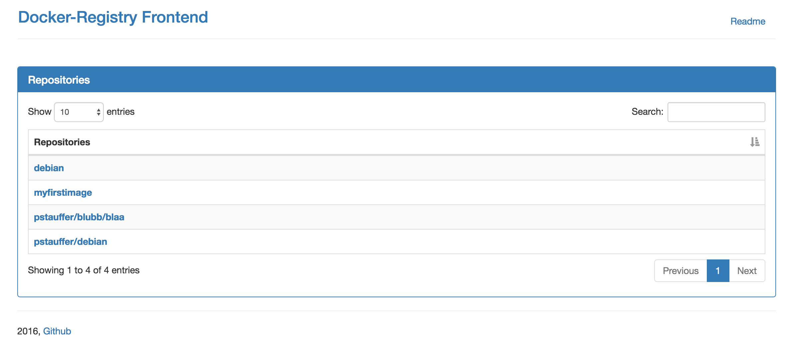
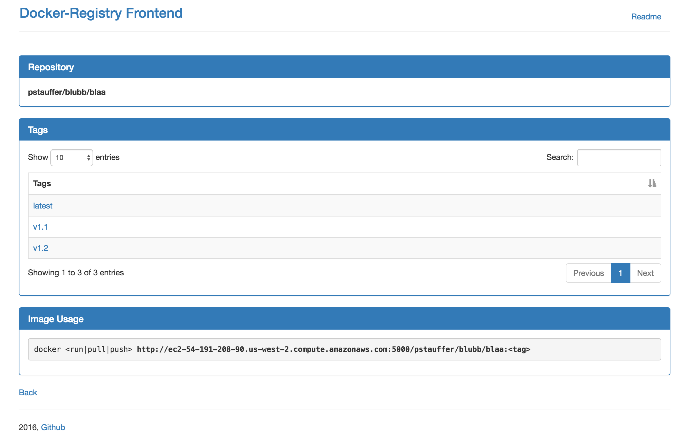
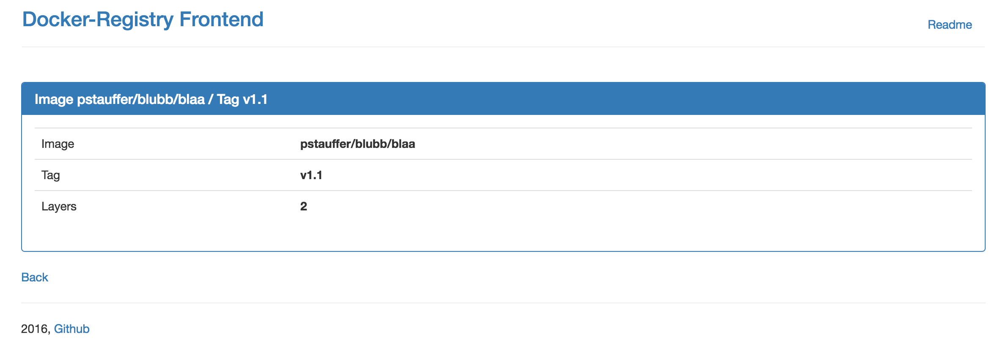

# docker-registry-frontend

## Description
This is a simple frontend for the official [docker-registry](https://docs.docker.com/registry/). The idea was to create a readonly frontend to only display all available repositories and tags.

[](https://microbadger.com/images/pstauffer/docker-registry-frontend)

To get an overview, just checkout the [screenshots](#screenshots). At the moment are the following features implemented:

* List all repositories
* List all tags of a repository
* Show tag details

The application can be run as [docker containter](#run-as-docker-container) or as [standalone application](#run-as-standalone-application).


## Run as Docker container

This application is automated build and available on [docker hub](https://hub.docker.com/r/pstauffer/docker-registry-frontend).

### Preparation

Change the environment variable ``REGISTRY_URL`` in the ``docker-compose.yml`` file.
```
REGISTRY_URL=https://docker-registry.example.com
```

### Base URL
This setting is optional, but if you need to set a base_url with a specified path for your docker-registry frontend, use the variable ``FRONTEND_URL``.
```
FRONTEND_URL=https://registry.example.com/frontend
```


### Basic Authentication

If the docker registry has basic authentication activated, you have to set the following environment variables in the ``docker-compose.yml`` file.
```
REGISTRY_AUTH=True
REGISTRY_USER=<user>
REGISTRY_PW=<password>
```

### Run Container
This will run the frontend application and a proxy container, which will forward your request to the application:

```bash
docker-compose up -d
```

After you've started the containers, the application is available on port 80.

## SSL verification
If you need to disable SSL verification of the registry, you can do so via ``REGISTRY_VERIFY_SSL``:
```
export REGISTRY_VERIFY_SSL=0
```

## Debugging
```
docker-compse logs
```

## Run as standalone application

### virtualenv

```
# install virtualenv and dependencies
virtualenv .venv
source .venv/bin/activate
pip install -r requirements.txt

# set registry url
export REGISTRY_URL=https://docker-registry.example.com

# run application
python app.py
```

## To Do
* Docs> How to run as standalone app (also with virtualenv)
* Docs> Link to official docker-compose docu
* Docs> How to run without docker-compose
* Feature> Add a configuration file
* Bugfix> Change port, not 5000 (conflict with docker-registry)
* Tests> Is it needed to expose the app port (maybe for the nginx container?!)
* Tests> Basic Auth as Container & Standalone App


## Informations
* [Docker API](https://docs.docker.com/registry/spec/api)


## Screenshots
Here are some screenshots to get an overview about the docker-registry frontend.





## License
This project is licensed under [MIT](http://opensource.org/licenses/MIT).
